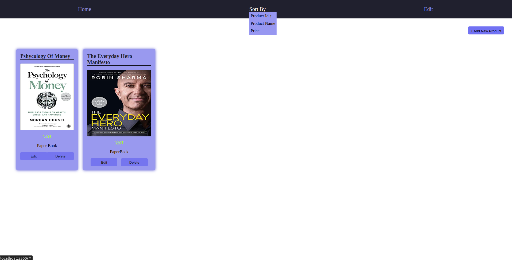
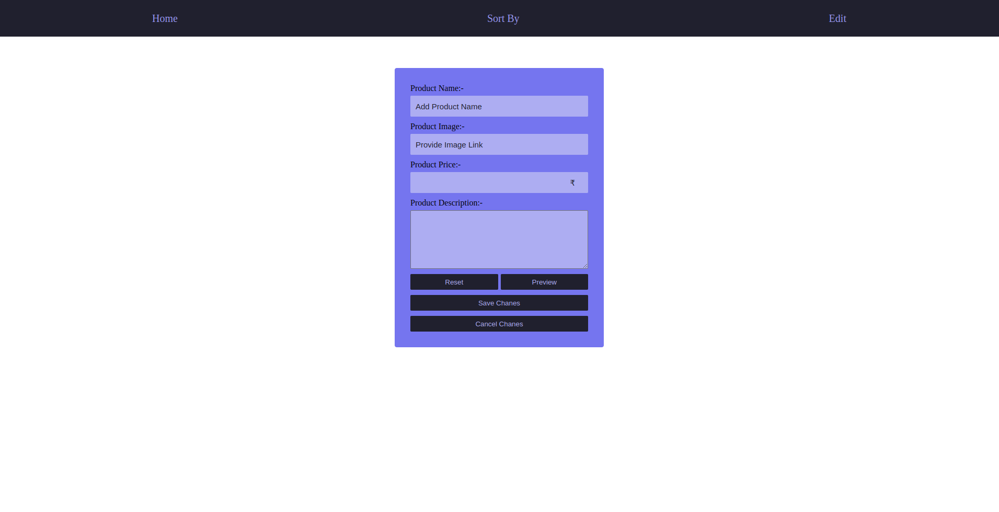

# Product Management site (JS-CRUD)

## Submission By Manav Panchal (Block-chain Trainee 2023)

Screenshots of web page :-

<!DOCTYPE html>
<html lang="en">
<head>
    <meta charset="UTF-8">
    <meta http-equiv="X-UA-Compatible" content="IE=edge">
    <meta name="viewport" content="width=device-width, initial-scale=1.0">
</head>
<body>
    
    

    As you can see in above picture, you can sort the product by it's ID, Name and Price,
    you can also edit the product by clicking edit button on navbar nad you can also delete the product and even add the new product.
    

    Below page is for changing the data of product
    
</body>
</html>
